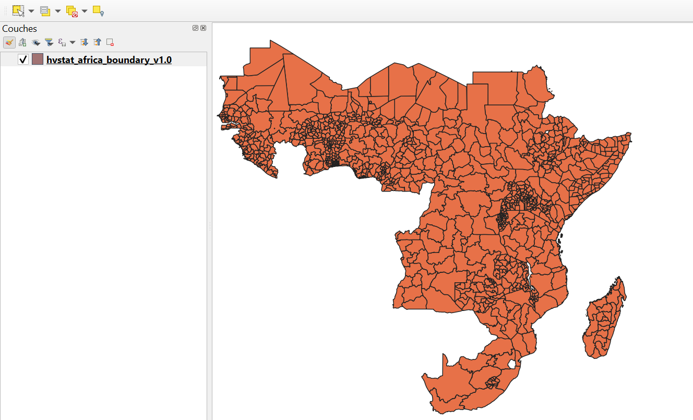
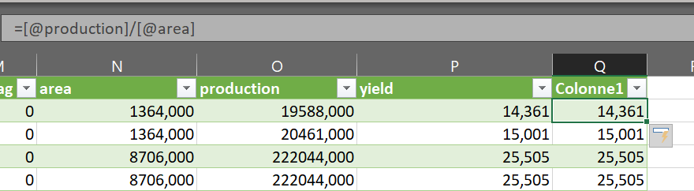

```{r setup}
knitr::opts_chunk$set(echo = TRUE)
```

# Question 1

a)  L'unité statistique d'observation ici est décrite par un ensemble de 16 variables parmi lesquelles:

-   fnid: Cette variable est un identifiant géographique **unique** qui se trouve à la fois dans le fichier CSV et dans le fichier Geopackage ( D'après la table des attributs ouverte sur le fichier gpkg avec le logiciel QGIS) . Ainsi, cette variable nous permettra par la suite pouvoir lier les données du CSV et celles du gpkg selon les besoins.
-   admin_1: Il s'agit d'une information spatiale de niveau 1 qui nous permet d'identifier la région ou la province selon le découpage administratif du pays.
-   admin_2: Il s'agit d'une information spatiale de niveau 2 qui nous permettra d'identifier le département ou le district selon le découpage administratif du pays.
-   product: C'est le nom de la culture agricole considérée qui nous permettra de faire des filtres par culture afin par exemple de calculer le rendement par culutre.
-   season_name: C'est la saison de culture , elle nous permettra d'analyser les rendements par saison.

b)  La différence conceptuelle entre area ,production et yield est que area correspond à la superficie cultivée , production correspond à la production agricole tandis que yield est le rendement ie le rapport entre la production et la superficie. La relation théorique existante est que le rendement vaut la quantité de production par unité de superficie. Comme le montre la vérification par image suivante



# Question 2

a)  Analysons la distribution de qc_flag par pays et par culture

```{r setup}
# Les chemins dynamiques

data_path <- "../data/"
output_path <- "../output/"
script_path <- "./"

df <- read.csv(paste0(data_path, "hvstat_africa_data_v1.0.csv"))

```

```{r setup}
# Les librairies nécessaires

library(tidyverse)
library(knitr)
library(kableExtra)
library(ggplot2)

```

```{r}

# verifions la structure globale de cette variable

table_qc_global <- df %>%
  count(qc_flag) %>%
  mutate(pourcentage = round(n / sum(n) * 100, 2))

table_qc_global
```

Ainsi, globalement on a 98,48 % des observations ayant un indicateur de qualité ok, 0,29% ayant des valeurs aberrantes et 1,23% des observations ont des indicateurs de qualité à faible variance.

```{r}


```

```{r}

# Distribution de qc_flag par pays 

table_qc_pays_pct <- df %>%
  group_by(country) %>%
  mutate(total_pays = n()) %>%
  group_by(country, qc_flag, total_pays) %>%
  summarise(n = n(), .groups = "drop") %>%
  mutate(pourcentage = round(n / total_pays * 100, 2)) %>%
  select(country, qc_flag, pourcentage) %>%
  pivot_wider(names_from = qc_flag, 
              values_from = pourcentage, 
              values_fill = 0,
              names_prefix = "qc_")

#on peut regarder tous les pays par:
table_qc_pays_pct

#ou regarder le top dix des pays par: 
top10_meilleure_qualite <- table_qc_pays_pct %>%
  arrange(desc(qc_0)) %>%
  head(10)
top10_meilleure_qualite

```

Le burundi , la DRC, la guinée , le liberia , le rwanda font parti des top pays qui ont un indicateur de qualité ok. On peut faire une visualisation en restreignat les pays a ceux ci:

```{r}

#filtre de pays 
pays_cibles <- c("Benin", "Burkina Faso", "Cote d'Ivoire", "Mali", "Togo", "Niger")

df_filtre <- df %>%
  filter(country %in% pays_cibles,
         harvest_year >= 2015,
         harvest_year <= 2020)


# graphique qc_flag par pays
g1 <- ggplot(df_filtre, aes(x = country, fill = factor(qc_flag))) +
  geom_bar(position = "fill") +
  labs(title = "Distribution de qc_flag par pays (2015-2020)",
       x = "Pays",
       y = "Proportion",
       fill = "QC Flag") +
  scale_y_continuous(labels = scales::percent) +
  theme_minimal() +
  theme(axis.text.x = element_text(angle = 45, hjust = 1))

ggsave(paste0(output_path, "qc_flag_par_pays.png"), g1, width = 10, height = 6)
print(g1)

```

Le burkina, le mali et le togo ont, sur la periode 2015-2020 moins de cultures avec des indicateurs de qualités aberrants ou a faible variance que le benin et le mali.

```{r}
# Distribution de qc_flag par culture 

table_qc_culture_pct <- df %>%
  group_by(product) %>%
  mutate(total_culture = n()) %>%
  group_by(product, qc_flag, total_culture) %>%
  summarise(n = n(), .groups = "drop") %>%
  mutate(pourcentage = round(n / total_culture * 100, 2)) %>%
  select(product, qc_flag, pourcentage) %>%
  pivot_wider(names_from = qc_flag, 
              values_from = pourcentage, 
              values_fill = 0,
              names_prefix = "qc_")

#on peut regarder tous les pays par:
table_qc_culture_pct

#ou regarder le top six des pays par:
top10 <- table_qc_culture_pct %>%
  arrange(desc(qc_0)) %>%
  head(10)

top10
```

Les avocats, les haricots, les carottes sont des cultures avec un indicateur de qualité globlement TOUJOURS ok.

Deplus, on observe Ici, La variable a moins de valeur qui 1 ie aberrante, Etant donné que le qc_flag varie moins en fonction du produit, on peut conclure de cette question que le qc_flag est un indicateur de qualité d'une culture. On peut aussi visualiser:

```{r}

# Graphique qc_flag par culture
g2 <- ggplot(df_filtre, aes(x = product, fill = factor(qc_flag))) +
  geom_bar(position = "fill") +
  labs(title = "Distribution de qc_flag par culture (2015-2020)",
       x = "Culture",
       y = "Proportion",
       fill = "QC Flag") +
  scale_y_continuous(labels = scales::percent) +
  theme_minimal() +
  theme(axis.text.x = element_text(angle = 45, hjust = 1))

ggsave(paste0(output_path, "qc_flag_par_culture.png"), g2, width = 12, height = 6)
print(g2)

```

Les cultures commes l ail , les patates et les tomates ont globlament sur la période 2015-2020 un indice de qualité indiquant une faible variance dans leur valeur.

b)  stratégie pour traiter les observations avec qc_1, qc_2

    ```{r}

    # nous pouvons remplacer par la médiane du groupe formée du pays, la culture et lannée, le qc_flag = 1 
    # pour qc_flag = 2 :nous pouvons  conserver les qc_2  car ce n'est pas nécessairement problématique

    df_corrige <- df_filtre %>%
      group_by(country, product, harvest_year) %>%
      mutate(
        yield_median = median(yield[qc_flag == 0], na.rm = TRUE),
        yield_corrige = ifelse(qc_flag == 1, yield_median, yield)
      ) %>%
      ungroup()

    #  corrections
    corrections <- data.frame(
      qc_flag = c(0, 1, 2),
      effectif = c(sum(df_filtre$qc_flag == 0, na.rm = TRUE),
                   sum(df_filtre$qc_flag == 1, na.rm = TRUE),
                   sum(df_filtre$qc_flag == 2, na.rm = TRUE)),
      pourcentage = round(c(
        mean(df_filtre$qc_flag == 0, na.rm = TRUE) * 100,
        mean(df_filtre$qc_flag == 1, na.rm = TRUE) * 100,
        mean(df_filtre$qc_flag == 2, na.rm = TRUE) * 100
      ), 2),
      traitement = c("Conservé", "Remplacé par médiane", "Conservé")
    )

    write.csv(corrections, 
              paste0(output_path, "df_corrige.csv"), 
              row.names = FALSE)
    ```

```{}
```

# Question 3

```{r}

#Calculons les stats desc par pays et par culture.

```

```{r}

stats_pays <- df_corrige %>%
  filter(!is.na(yield_corrige)) %>%
  group_by(country) %>%
  summarise(
    n_observations = n(),
    moyenne = round(mean(yield_corrige, na.rm = TRUE), 2),
    mediane = round(median(yield_corrige, na.rm = TRUE), 2),
    q25 = round(quantile(yield_corrige, 0.25, na.rm = TRUE), 2),
    q75 = round(quantile(yield_corrige, 0.75, na.rm = TRUE), 2),
    minimum = round(min(yield_corrige, na.rm = TRUE), 2),
    maximum = round(max(yield_corrige, na.rm = TRUE), 2),
    ecart_type = round(sd(yield_corrige, na.rm = TRUE), 2),
    coefficient_variation = round(sd(yield_corrige, na.rm = TRUE) / 
                                    mean(yield_corrige, na.rm = TRUE), 2)
  ) %>%
  arrange(desc(moyenne))

write.csv(stats_pays, 
          paste0(output_path, "statistiques_faites_par_pays.csv"), 
          row.names = FALSE)

print(stats_pays)


```

```{r}

stats_culture <- df_corrige %>%
  filter(!is.na(yield_corrige)) %>%
  group_by(product) %>%
  summarise(
    n_observations = n(),
    moyenne = round(mean(yield_corrige, na.rm = TRUE), 2),
    mediane = round(median(yield_corrige, na.rm = TRUE), 2),
    q25 = round(quantile(yield_corrige, 0.25, na.rm = TRUE), 2),
    q75 = round(quantile(yield_corrige, 0.75, na.rm = TRUE), 2),
    minimum = round(min(yield_corrige, na.rm = TRUE), 2),
    maximum = round(max(yield_corrige, na.rm = TRUE), 2),
    ecart_type = round(sd(yield_corrige, na.rm = TRUE), 2),
    coefficient_variation = round(sd(yield_corrige, na.rm = TRUE) / 
                                    mean(yield_corrige, na.rm = TRUE), 2)
  ) %>%
  arrange(desc(moyenne))

write.csv(stats_culture, 
          paste0(output_path, "stats_rendement_par_culture.csv"), 
          row.names = FALSE)

print(stats_culture)


```

En moyenne,37 pour cent des cultures des pays considérés sont la canne à sucre.

```{r}
# PAR pays ET CULTURE


stats_pays_culture <- df_corrige %>%
  filter(!is.na(yield_corrige)) %>%
  group_by(country, product) %>%
  summarise(
    n_observations = n(),
    moyenne = round(mean(yield_corrige, na.rm = TRUE), 2),
    mediane = round(median(yield_corrige, na.rm = TRUE), 2),
    ecart_type = round(sd(yield_corrige, na.rm = TRUE), 2),
    .groups = "drop"
  ) %>%
  arrange(country, desc(moyenne))

write.csv(stats_pays_culture, 
          paste0(output_path, "stats_rendement_pays_culture.csv"), 
          row.names = FALSE)

print(stats_pays_culture)

```

# Question 4

```{r}

#comparons les distributions de rendement suivant les systèmes de production

#  les systèmes disponibles
cat("Systèmes de production disponibles :\n")
table(df_corrige$crop_production_system)

# Statistiques par système de production
stats_systeme <- df_corrige %>%
  filter(!is.na(yield_corrige), 
         !is.na(crop_production_system),
         crop_production_system != "") %>%
  group_by(crop_production_system) %>%
  summarise(
    n_observations = n(),
    moyenne = round(mean(yield_corrige, na.rm = TRUE), 2),
    mediane = round(median(yield_corrige, na.rm = TRUE), 2),
    q25 = round(quantile(yield_corrige, 0.25, na.rm = TRUE), 2),
    q75 = round(quantile(yield_corrige, 0.75, na.rm = TRUE), 2),
    ecart_type = round(sd(yield_corrige, na.rm = TRUE), 2)
  ) %>%
  arrange(desc(moyenne))

write.csv(stats_systeme, 
          paste0(output_path, "stats_rendement_par_systeme.csv"), 
          row.names = FALSE)

print(stats_systeme)

```

En moyenne , 17 % des pays adoptent comme système de production le : irrigated

```{r}

# Graphique de comparaison des systèmes
g3 <- ggplot(df_corrige %>% 
               filter(!is.na(yield_corrige), 
                      !is.na(crop_production_system),
                      crop_production_system != ""),
             aes(x = crop_production_system, y = yield_corrige)) +
  geom_boxplot(fill = "lightblue") +
  labs(title = "Distribution du rendement par système de production (2015-2020)",
       x = "Système de production",
       y = "Rendement (t/ha)") +
  theme_minimal() +
  theme(axis.text.x = element_text(angle = 45, hjust = 1))

ggsave(paste0(output_path, "rendement_par_systeme.png"), g3, width = 10, height = 6)
print(g3)
```

```{r}

```

Malgrés que beaucoup dobservations sont avec le système irrigated, on en a plusieurs hors des valeurs moyennes

# Zoom sur le sénégal , processus de construction de la matrice de contiguité spatiale à partir de fnid ou admin_1
